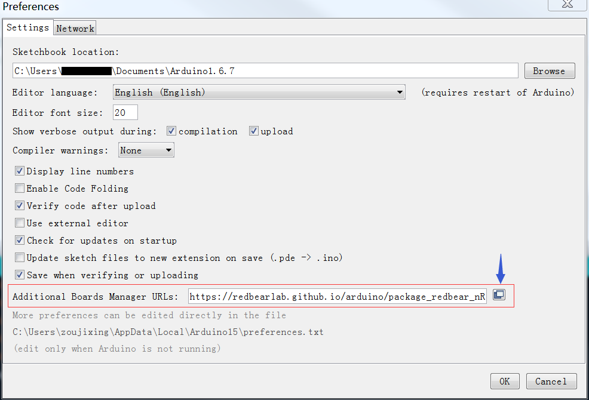
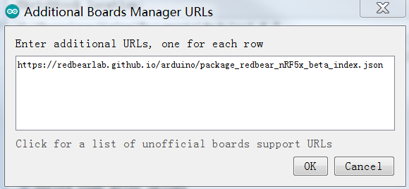
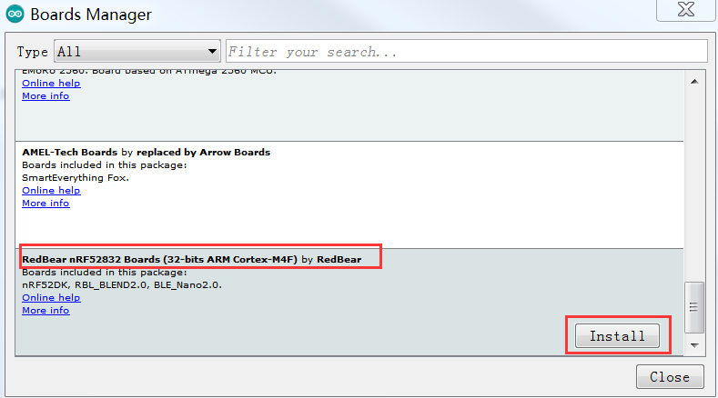
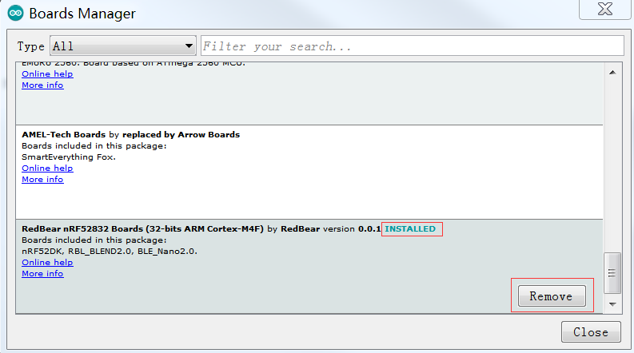
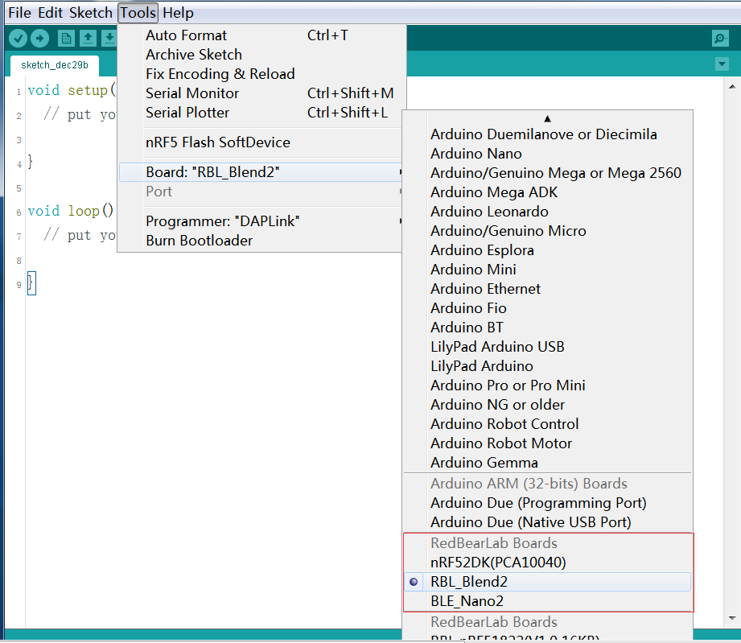
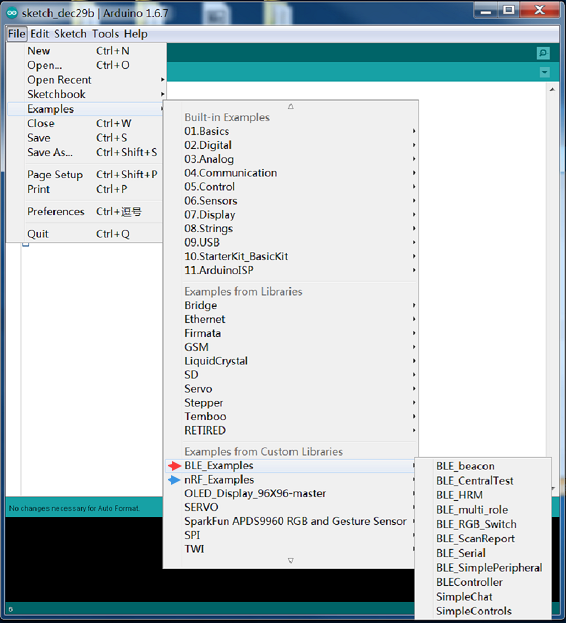

# nRF52 - Arduino Installation Guide

* The nRF52 boards support developing applications using Arduino IDE 1.8.0 or above.
* Current tested version 1.8.0

## Install nRF52 Board Package

We assume that you have installed Arduino IDE 1.8.0 or above on your computer, or you have to [download](https://www.arduino.cc/en/Main/Software) and install it first. To install the board package for the nRF52 boards, please work through the following steps.

1. Start Arduino IDE.

2. Click "File->Preferences", then show:

    
  
3. Click on the icon on the right. On the pop up window, new a row and fill it with ***https://redbear.github.io/arduino/package_redbear_nRF5x_beta_index.json.*** Click on "OK" to close the preferences window.

    

4. Navigate to "Tools > Board > Boards Manager". Wait until Arduino IDE download the json file we specified before. Then scroll the window to find the RedBear nRF52832 board. Select the version and click on the "Install", it will automatically download and install the board package for the RedBear nRF52832.

    

5. After the board package installed, you will see the column for RedBear Duo is marked as "INSTALLED". Click on "Close" to shut down the Boards Manager.

    

6. After installing board package successfully, naviagte to "Tools > Board", you can now select boards below:

    

7. After selecting a board, you can compile and upload the examples. It contains "BLE_Examples" (BLE) and "nRF_Examples" (Peripherals, e.g. UART/GPIO).

    
    